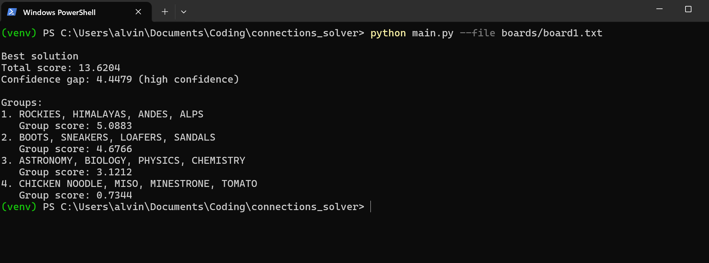
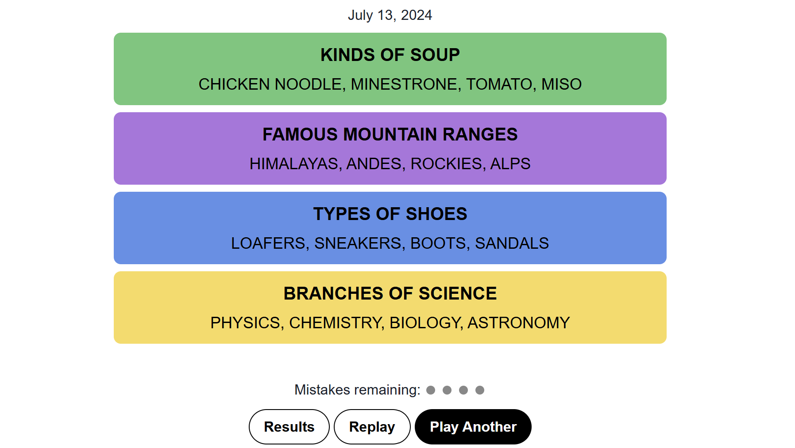
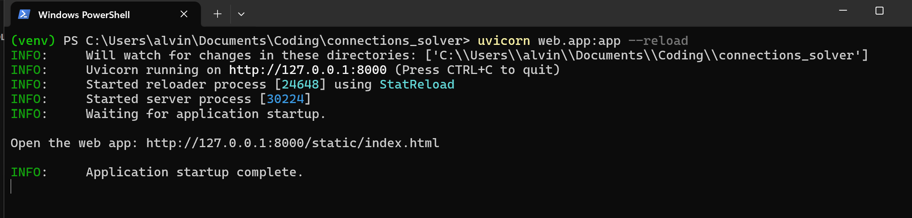
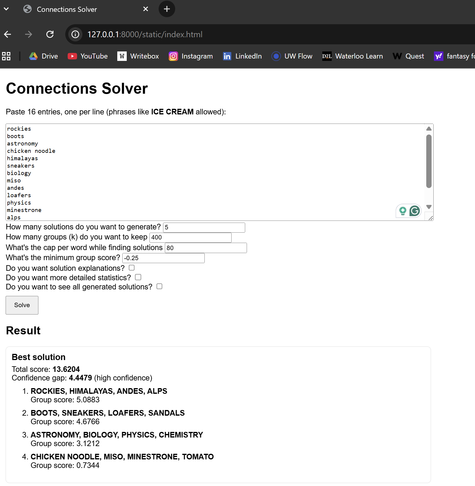

# NYT Connections Solver (CLI + Web)

Have you ever struggled with the NYT connections game? If you have, you aren't alone. Instead of closing the tab and "rage-quitting", I created a python-based tool that could assist me in solving this daily puzzle. It generates all 4-word combinations from 16 entries, scores them using **sentence embeddings + heuristics**, prunes the search space, then uses **backtracking** to find the best full-board solution. The output includes a **confidence gap** so you can tell when it’s guessing. groups using sentence embeddings + hardcoded word-pattern heuristics, then searches for the best disjoint partition into 4 groups.

## What it does
- Generates all candidate 4-word groups from 16 entries (**1820** groups)
- Scores groups using:
  - SentenceTransformer embeddings (semantic similarity)
  - Heuristics (word/letter patterns, curated categories, phrase glue)
- Prunes candidates (number of groups + per-word cap)
- Finds best full-board solutions via backtracking search
- Outputs:
  - **Best solution + confidence label** (default)
  - Optional additional solutions + debug stats

## Features
- CLI: solve from a file or pasted input
- Web UI: paste 16 entries and get best solution + confidence score
- Explain mode: shows similarity stats + heuristic contributions for each group

## Demo:

### CLI
  

### Web
  

---

### How to run it:

## 1) Clone the repo:

**In the terminal, run:**

git clone https://github.com/alvinli7/connections-solver.git

cd connections-solver

## 2) Create a Virtual Environment

**For Windows, run:**

python -m venv venv
venv\Scripts\Activate

**For MacOS & Linux, run:**

python3 -m venv venv
source venv/bin/activate

**Then install dependencies:**

pip install -r requirements.txt

## 3) Running the CLI

**Basic (clean output):**
python main.py --file boards/toy.txt

**Explain (best solution only):**
python main.py --file boards/toy.txt --explain

**Show additional solutions:**
python main.py --file boards/toy.txt --more

**Show debug details (words/params/candidate stats):**
python main.py --file boards/toy.txt --details --debug

## 4) Running the web:

**Start the Backend:**
uvicorn web.app:app --reload

**Open the web UI:**
http://127.0.0.1:8000/static/index.html

API docs: http://127.0.0.1:8000/docs

# Notes / Limitations

Most NYT puzzles rely on pop-culture or trivia knowledge; this solver performs best on semantic + pattern-based boards.
Heuristics are intentionally lightweight and extensible (curated lists + pattern logic).

# Troubleshooting

**PowerShell: “running scripts is disabled”, run:**
Set-ExecutionPolicy -Scope CurrentUser RemoteSigned

**Then re-run:**
venv\Scripts\activate

**Dependency install issues (Torch / SentenceTransformers):**
**If pip install -r requirements.txt fails, try upgrading pip first, run:**

python -m pip install --upgrade pip

# Tech Stack
Python

FastAPI + Uvicorn (web wrapper)

SentenceTransformers (semantic embeddings)

Backtracking search + pruning strategies

Heuristic scoring (patterns, lexicons, phrase glue)
